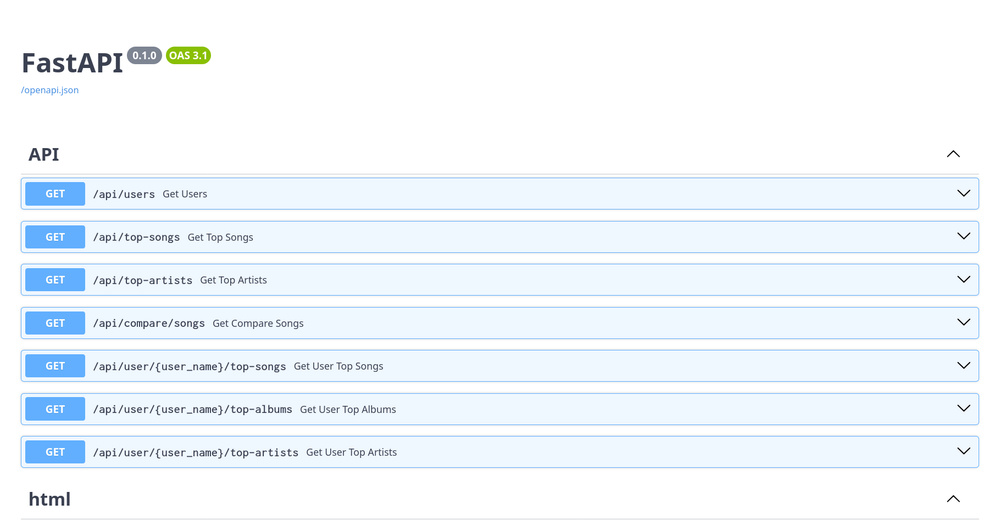
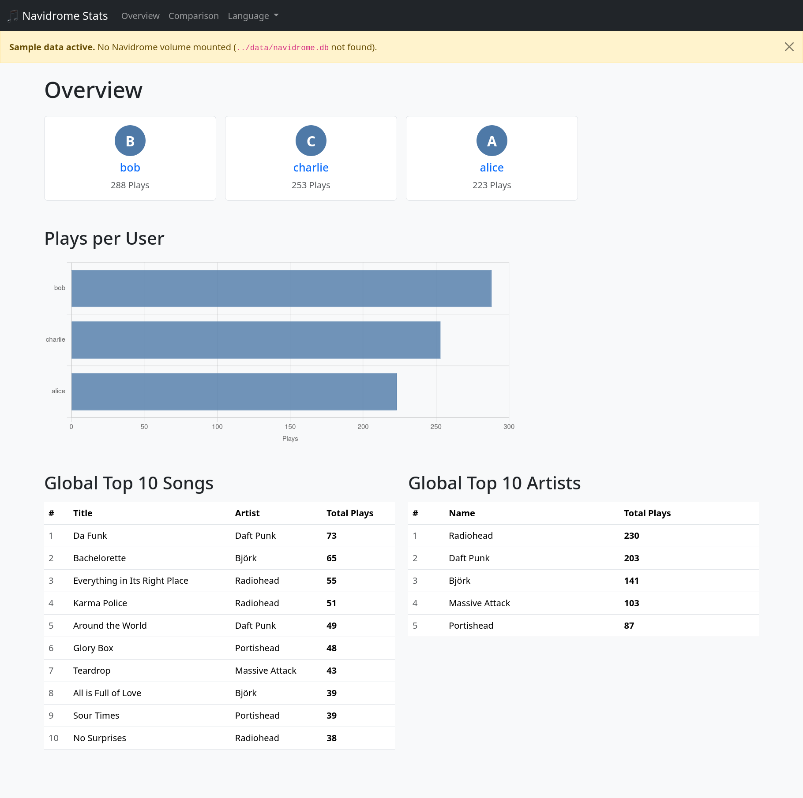
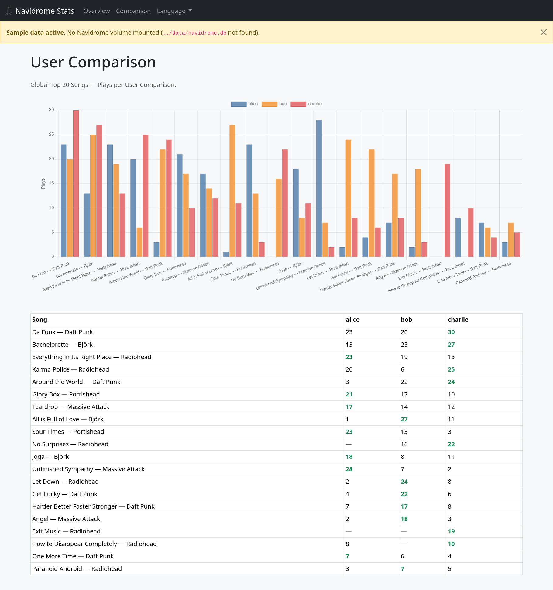
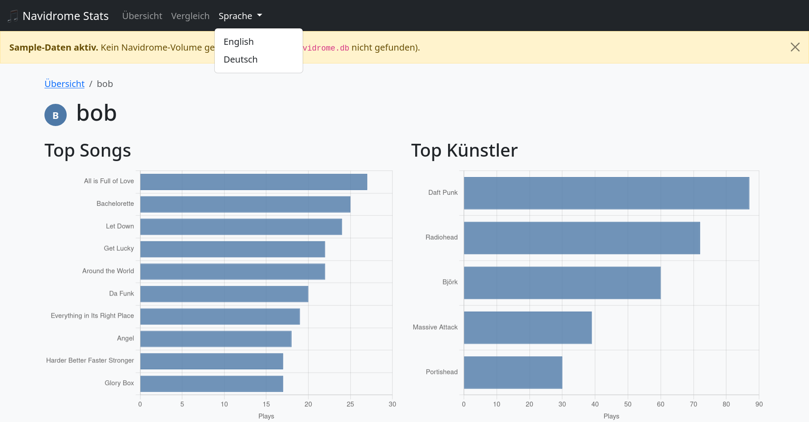

# Navidrome Stats

A web dashboard for visualizing listening statistics from a [Navidrome](https://www.navidrome.org/) music server. It reads directly from the Navidrome SQLite database and displays top songs, albums, and artists per user, as well as a cross-user comparison view.

## Features

- **Overview** — all users ranked by total play count, global top 10 songs
- **User detail** — top songs, albums, and artists for each user
- **Compare** — cross-user heatmap of the most played songs

## Requirements

- Docker & Docker Compose
- A running Navidrome instance (the `navidrome.db` file must be accessible)

## Setup

1. Copy the example environment file and adjust the values:

   ```bash
   cp .env.example .env
   ```

2. Edit `.env`:

   | Variable            | Default                    | Description                                      |
   |---------------------|----------------------------|--------------------------------------------------|
   | `HOST_PORT`         | `8080`                     | Port on the host to expose the dashboard         |
   | `NAVIDROME_DB_PATH` | `/opt/navidrome/data`      | Path to the Navidrome data directory (read-only) |

3. Start the container:

   ```bash
   docker compose up -d
   ```

The app listens on port `8000` inside the container. Docker publishes that to the host via `HOST_PORT`, so the dashboard is available at `http://localhost:8080` (or whichever port you configured).

## Docker Image

Pre-built images for `linux/arm64` are published to the GitHub Container Registry on every release:

```bash
docker pull ghcr.io/sirtheta/navidrome-stats:latest
```

To use the published image instead of building locally, replace the `build:` line in `docker-compose.yml`:

```yaml
services:
  navidrome-stats:
    image: ghcr.io/sirtheta/navidrome-stats:latest
```

## Development

Run locally without Docker (requires Python 3.12+):

```bash
cd src
uv sync
uv run fastapi dev
```

If `navidrome.db` is not found at the configured path, the app automatically falls back to built-in sample data so the UI is still usable.

## API
The list of API endpoints can be found on Swagger UI at `http://localhost:8080/docs` (or `http://localhost:8000/docs` when running locally without Docker). The app itself listens on `8000` inside the container; the host port is mapped by `HOST_PORT`.



## Screenshots
- Overview

- Comparison

- User Details

